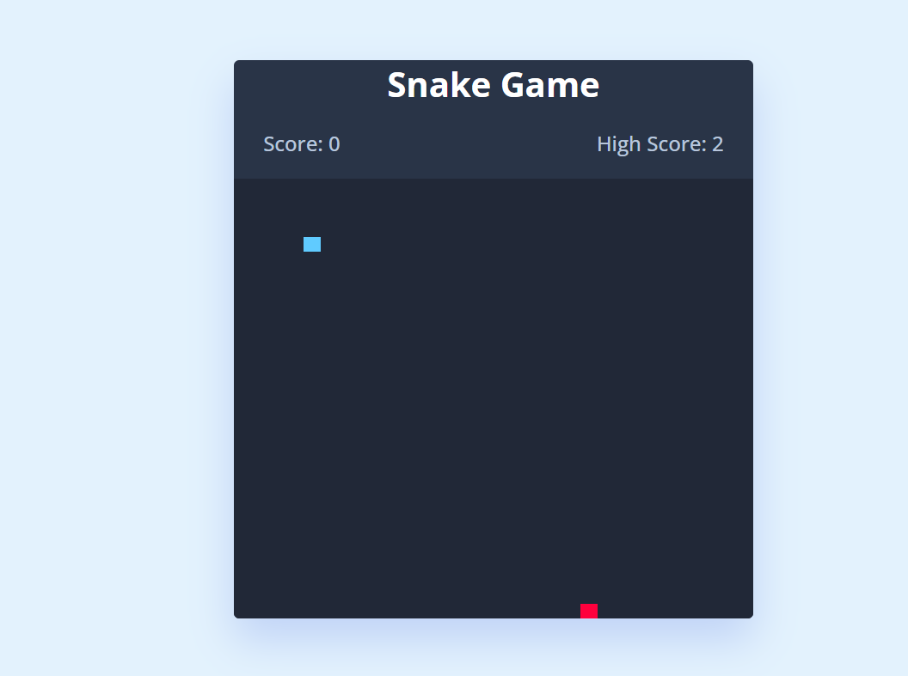

# Snake Game

A simple Snake Game implementation using HTML, CSS, and JavaScript.
## 🔗 Links

https://shashank-project-github.github.io/snake-game/

## Overview
This project demonstrates a classic Snake Game where the player controls a snake to eat food and grow longer. The game features include:

- Score Tracking: Displays current score and keeps track of the highest score achieved.
- Responsive Design: Designed to be responsive and playable on different screen sizes.
- Controls: Use arrow keys or on-screen controls (for mobile or touch devices) to change the snake's direction.
- Game Over: Alerts the player when the game ends due to hitting walls or colliding with itself.

## Screenshot

